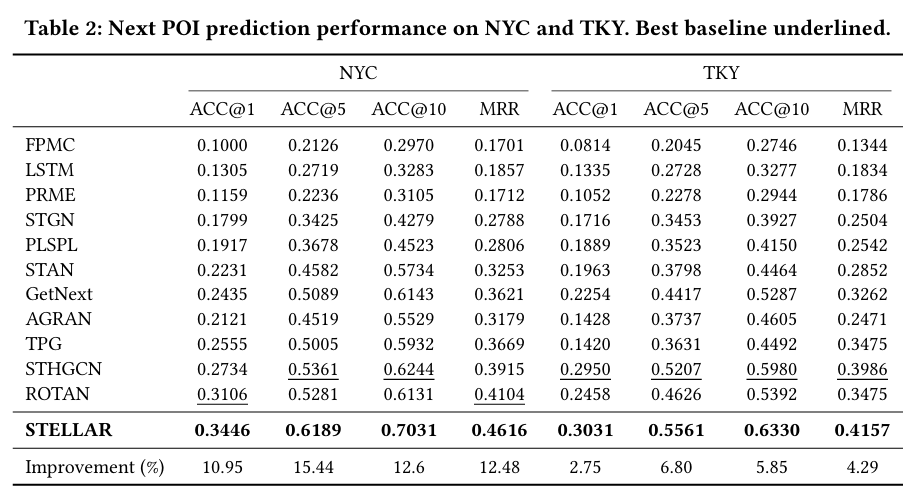

# STELLAR (Anonymous Implementation)

This repository provides the official **anonymous implementation** of **STELLAR**,  
a model proposed for **Next Point-of-Interest (Next-POI) Recommendation**,  
submitted to **SIGIR**.

> ⚠️ This repository is released for **double-blind review**.  
> Any identifying information has been removed.


# Overview


STELLAR is a spatiotemporal representation learning framework for next-POI prediction that integrates:

- Spatial representation (space embeddings)  
- POI semantics  
- User relational structure  
- LLM-based backbone comparison  

This repository contains:
- Full training & evaluation pipeline  
- Preprocessing scripts  
- Embedding generation pipeline  
- Main experiments, ablation studies, and backbone comparison  


# Installation

1. Clone this repository

```bash
git clone <anonymous-repo-url>
cd STELLAR
```

2. Install dependencies

```bash
pip install -r requirements.txt
```


# Dataset

We use two public trajectory datasets collected from **Foursquare**:

- **Foursquare-NYC**: New York City  
- **Foursquare-TKY**: Tokyo  

Both datasets cover **11 months (Apr. 2012 – Feb. 2013)**.

## Setup

1. Unzip `data.zip` inside the `STELLAR/` directory  
2. Rename the extracted folder to `data`

```
STELLAR/
└── data/
    ├── nyc/
    └── tky/
```


## Preprocessing Pipeline

Before training, you must generate **all required embeddings**.

### Step 1. Raw data preprocessing

```bash
python3 Preprocess/make_basic_data.py
```


### Step 2. Generate initial embeddings

These embeddings are **mandatory** for running STELLAR.  
All outputs are saved under:

```
data/{dataset}/graph/
```

#### (1) POI initial embeddings
```bash
python3 Make_Embedding/run_poi_init_embedding.py
```

#### (2) Space embeddings
```bash
python3 Make_Embedding/run_space_embedding.py
```

#### (3) User neighbor construction
```bash
python3 Make_Embedding/run_user_neighbor.py
```


# Experiments

Before running any experiment, set the `PYTHONPATH`:

```bash
export PYTHONPATH={YOUR_STELLAR_PATH}:$PYTHONPATH
```


## 1. Main Experiment

### Training

```bash
python3 Model/Main/train.py
```

### Commands

* **NYC**
```bash
python3 train.py --data nyc --lambda_cat 1 --lambda_loc 1
```

* **TKY**
```bash
python3 train.py --data tky --lambda_cat 1 --lambda_loc 0
```

### Results



The following figure reports the main experimental results of STELLAR on the NYC and TKY datasets.
STELLAR consistently outperforms all competitive baselines across all evaluation metrics.


## 2. Ablation Studies

### (1) Embedding Component Ablation

```bash
python3 Model/Embedding_Ablation/train.py
```

* Command format:
```bash
python3 train.py --data {dataset} --use_{component_name} False
```

* Example:
```bash
python3 train.py --data nyc --use_space False
```


### (2) LLM Backbone Comparison

* Training:
```bash
python3 Model/LLM_Ablation/{backbone}_train.py
```

* Command format:
```bash
python3 {backbone}_train.py --data {dataset} --backbone {backbone}
```


## Reproducibility
- Python 3.10.19  
- PyTorch 2.9.0 (CUDA 12.8) 
- Fixed random seeds  
- Deterministic CUDA settings  
- Automatic logging & checkpointing  

---

